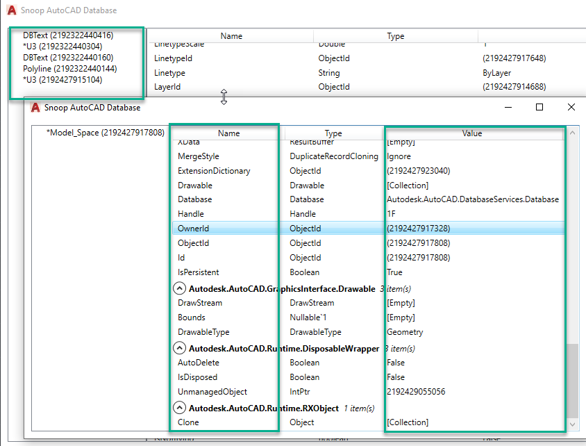

### Introduce

Add-In Interactive Autocad BIM database exploration tool to view and navigate element properties and relationships.

### Setup

Open the SnoopAutoCADCSharp.sln on Visual Studio 2017. All references should be ready for AutoCAD 2022 default install path, otherwise go to project properties >> References, then click on Reference Paths and adjust. Build the project in Release, the DLL should be placed at same folder. Copy the entire .bundle folder to C:\Program Files\Autodesk\Autodesk\ApplicationPlugins folder and launch Autocad.

### Version

The most up-to-date version provided <a href="https://github.com/chuongmep/SnoopAutoCADCSharp/releases">here</a>  is for Autocad 2022.
- <a href="https://github.com/chuongmep/AutoCADLookup/releases/tag/1.0.0">2022</a>  for Autocad 2022
- <a href="https://github.com/chuongmep/AutoCADLookup/releases/tag/1.0.0">2021</a>  for Autocad 2021
- <a href="https://github.com/chuongmep/AutoCADLookup/releases/tag/1.0.0">2020</a>  for Autocad 2020
- <a href="https://github.com/chuongmep/AutoCADLookup/releases/tag/1.0.0">2019</a>  for Autocad 2019
- <a href="https://github.com/chuongmep/AutoCADLookup/releases/tag/1.0.0">2018</a>  for Autocad 2018

### Usage

- On AutoCAD , command the "SnoopAutocad" option, the main form should appear. At the left side is a list of the main collections on the active document. On the right side, the properties of the item selected on the left.

- Can continue Snoop Database to check.

### Author 

First Project write sypport Civi3D with language VB.NET by <a href="https://github.com/augustogoncalves">Augusto Goncalves</a> <a href="https://twitter.com/augustomaia">@augustomaia</a> , member of the Autodesk Developer Technical Services team.

Now project update and maintain in .NET C# by <a href="https://github.com/htlcnn">htlcnn</a> and <a href="https://github.com/chuongmep">Hồ Văn Chương</a> 

### Known Issues

The tool may stop working on some properties that cannot be reflected (using .NET).

### Demo

### Release History

1.0.0 : First Release

### Note

At the moment, project had updated and move to project with name <a href="https://github.com/chuongmep/CadPythonShell" target="_blank">CadPythonShell</a>, so let get it and exprerient, include some deep snoop and python console help you can become a boss in Cad API.